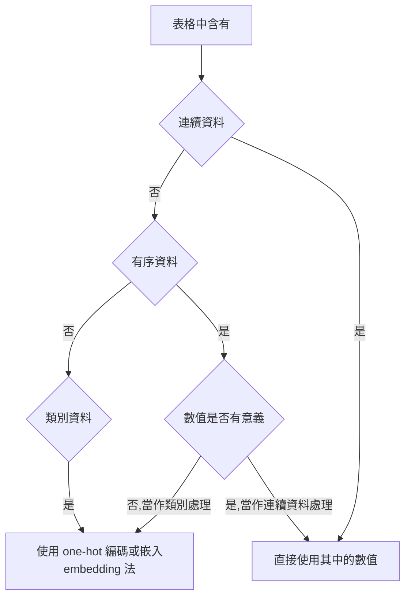

# pytorch

## 初始化
建立 conda env 和 activate:
```bash=
conda create --name pytorch python=3.6.8
conda avtivate pytorch
#移除環境
conda env remove --name pytorch
```
安裝套件:
```bash=
pip install -r requirements.txt

conda install pytorch torchvision torchaudio cudatoolkit=11.1 -c pytorch -c conda-forge

conda install h5py
```

開啟 Jupyter Notebook:
```bash=
Jupyter Notebook
```

## pytorch 常用函式庫
- 建構神經網路的核心模組位於 torch.nn 中，常見的有:
    - 完全連接層( fully connected layers )
    - 卷積層( convolutional layers )
    - 激活函數( activation functions )
    - 損失函數( loss functions )
- 載入和處理資料時，torch.util.data 是個好用的工具，主要有兩個類別(class)分別為:
    - Dataset，是連接使用者資料(任何格式的資料)和標準 PyTorch 張量的橋樑
    - DataLoader，他可以在後台生成子程序( child process )，並從資料集中在入資料
- 使用多個GPU或者讓多台機器同時訓練模型，可用 torch.nn.parallel.DistributedDataParallel 和 torch.distributed 來利用額外的硬體資源
- torch.optim 提供了優化模型的標準方法
- dtype 總覽:
    - torch.float32 or torch.float:32位元的單精度浮點數 (預設
    - torch.float64 or torch.double:64位元的雙精度浮點數
    - torch.float16 or torch.half:16位元的半精度浮點數
    - torch.int8:8位元的整數
    - torch.uint8:8位元的正整數
    - torch.int16 or torch.short:16位元的整數
    - torch.int32 or torch.int:32位元的整數
    - torch.int64 or torch.long:64位元的整數
    - torch.bool:布林值
- 常見 tensor 的操作:
    - Creation:用來創建張量的函式，ex: zeros(), ones()
    - Indexing、Slicing:用來改變張量的 shape 或內容的函式，ex: transpose()
    - Math:可以對張量數值進行運算的函式
        - Pointwise:對每一個元素進行轉換，並得到一個新張量，ex: abs()、cos()
        - Reduction:以迭代的方式對多個元素進行運算，ex: mean()、std()、norm()
        - Comparision:對張量內的元素值進行比較，ex: equal()、max()
        - Spectral:用來在頻域(frequency domain)和時域(time domain)中進行轉換和操作的函式，ex: stft()、hamming_window()
        - BLAS、LAPACK:BLAS代表基礎線性代數程式集(Basic Linear Algebra Subprograms)，LAPACK則代表線性代數套件(Linear Algebra PACKage)，它們專門用來處理純量、向量及陣列間的操作
        - 其他操作:特殊用途的函式，ex: 針對向量的cross()、針對矩陣的trace()
    - Random sampling:透過不同的機率分布進行隨機取樣，可用來生成亂數，ex: randn()、normal()
    - Serialization:用來讀取與儲存張量的函式，ex: load()、save()
    - Parallelism:在CPU的平行處理中，用來控制執行敘數量的函式，ex: set_num_threads()
    - 函式若結尾有 _ ，表示該方法為 in-place 操作，會直接修改記憶體內的值，而不是複製一份原始資料，處理後再傳回新張量
    - scatter_ 有 3 個參數:(常用來製作 one-hot)
        1. 要沿著哪個軸進行 one-hot 編碼( 1代表第 1 軸)
        2. 要進行 one-hot 編碼的來源張量(張量內的值表示 target_onehot 中哪一個索引位置要被設為非 0 的值)
        3. 設定 one-hot 編碼中非 0 的值為多少，通常是 1
        - 總結: 對於每一列，取目標標籤(就是第 2 個參數所指定的張量，在以上例子中，即個別樣本的品質分數)的值作為 one-hot 向量中的索引，設置相應值為 1.0
        - !! 來源張量(第二個參數)的軸數，必須與我們散佈(scatter)到的結果張量(target_onehot)相同，
        - 由於 target_onehot有兩個軸(4898x10)因此要用 unsqueeze() 將 target(1軸向量)增加 1軸
        ```python=
        #example:
        target_onehot = torch.zeros(target.shape[0], 10) #建立 shape 為 [4980, 10]，值均為 0 的張量，用來存放編碼結果

        a = target_onehot.scatter_(1, target.unsqueeze(1), 1.0) #依 target 的內容進行編碼
        ```
    - requires_grad:
        - 使用 requires_grad=True 後，PyTorch 會追蹤由 params 相關運算所產生的所有張量
        - 只要某張量的母張量中包 params，那麼從 params 到該張量之間所有的運算函數便會被記錄下來 
        - 假設這些函數皆可微分，那其導數變會自動地存入 params 張量的 grad 屬性之中
- loss.backward: 反向傳播
    - 呼叫 backward() 後，導數會被累加到葉節點的 grad 中
    - 假設我們先呼叫 backward() 一次、重新評估損失、然後再呼叫一次 backward()，則兩次呼叫 backward()的梯度會被相加，進而產生錯誤的結果
    - 為避免上述的問題，必須在每次訓練迴圈完成後，將梯度歸零
- with torch.no_grad():.
    - PyTorch autograd 不會在 with torch.no_grad() 區塊中運作，因此會將 with 內的運算過程加到運算圖中
    - 因此在下個回全建立新的前向運團前，不要更動到運算圖的內容，因此須將相關的城市放在 with torch.no_grad(): 中
- optim:
    - 每個優化器建構函式的第一個參數都是 內涵模型參數的張量，且該張量的 requires_grad 通常設為 True
    - 每個優化器有兩個 method: 
        - zero_grad(): 可以將所有參數張量的 grad 屬性歸零
        - step(): 可以根據優化器自身的優化策略來更新數值
- Dataset 包含兩個 method:
    - `__len__`會傳回資料集中有多少筆項目
    - `__getitem__`可用來存取特定元素的資料，其中包含元素本身及其相應的標籤(答案，為整數索引) => (feature, label)
- IterableDataset 為一進階工具，當資料集的隨機存取(random access)代價很高或不可用時，就可以使用它
- Subset: 當只需以索引值來取出資料集的子集(subset)，可使用 Subset
- ConcatDataset 能把擁有相容元素的多個資料集合併起來
- ChainDataset 可以協助建立可迭代的(iterable)大型資料集
- 分類問題的 loss:
    - 就數學上來說，將 nn.LogSoftmax 和 nn.NLLLoss 一起使用的效果相當於 nn.CrossEntropyLoss
    - nn.NLLLoss 計算交叉熵時所用的輸入為對數化機率，而 nn.CrossEntropyLoss 的輸入則是未經 softmax 或 LogSoftmax 處理的預測分數(又稱為 logits)
    - 就技術上來說，nn.NLLLoss 估算的是**狄拉克分布**(Dirac distribution;即所有機率值量落在一種可能性上)與模型預測分布(以對數化機率作為輸入計算而得)之間的交叉熵
    - 在資訊理論中，交叉熵可被理解為:在以目標分佈作為期望輸出的情況下，以模型預測分佈的負對數化概似率
    - 因此上述 nn.NLLLoss 和 nn.CrossEntropyLoss 都能視為:利用給定資料做出機率預測(結果經過 softmax 處理)時，模型參數的負對數化概似率

## 筆記
- 利用深度學習來完成任務需要的條件:
    1. 找到能處理輸入資料的方法
    2. 定義深度學習機器(或稱為模型)
    3. 找到能進行訓練以及萃取特徵，並讓行輸出正確答案的自動化方法
- 為了訓練模型需要準備的東西:
    1. 一組訓練資料集
    2. 一個可根據【訓練資料集】去調整【模型參數】的優化器
    3. 一個將模型和資料與硬體整合，並利用硬體來進行訓練的方法
- 張量:
    - 張量中的數值被置放於連續的記憶體區塊中，以一個 storage 為一個幾本儲存單位
    - 一個 storage 儲存了包含數值資料的 1軸連續陣列，可為 float32、int64 ......
    - 張量是用來呈現 storage 的視圖(view)，它讓我們能依照偏移量(offset)和步長(stride)來索引 storage 的內容
    - 張量能用多種方式對同一個 storage 進行索引，進而產生不同的張量，ex: 對同為1維陣列的 storage，分別以 (3, 2) (2, 3) 等不同 shape 來取用它，則會產生不同的 shape 的 tensoe 
- 要對 storage 進行索引，張量必須一類一些和 storage 相關的資訊:
    - 大小(size)(在 NumPy 中稱為 shape):
        - 是一個 tuple，表示張量在軸上有多少元素
        - ex: (列, 行) => (2, 3)，表示 有2列，每一列3個元素
    - 偏移(offset)
        - 是張量中首個元素在 storage 中的索引值，預設是 0
        - ex: offset=1，則張量的首個元素在 storage 中索引為 1
    - 步長(stride)
        - 是在提取各軸的下一個元素時，需要跳過的元素數量
        - ex: stride = (3, 1)，表示 +3 => next row，+1 => next col
    - 要知道索引(i, j)的元素在 storage 中的索引值，可透過以下取得:
    ```python
    storage_offset + stride[0] * i + stride[1] * j
    ```
    - 張量和 storage 的間接轉換讓一些操作(ex: 轉置張量或提取子張量)變得方便，因為記憶體無需重新分配，透過修改大小、偏移、步長產生一個新的張量
    - 轉置的概念就是 步長 x,y => y,x 交換
- PyTorch 與 NumPy 的互通性:
    - 使用 numpy() 轉換後會回傳一個與 points 相同 shape 和內容的 Numpy 多維陣列
    - 這個 NumPy 陣列會跟張量共用同一個底層記憶體
    - 若修改了 NumPy 陣列中的內容，原本的張量內容也會一起修改
    - 若張量是存放在 GPU 中，PyTorch 會把內容複製一分到 CPU，並把資料型別轉換為 NumPy  陣列
    - PyTorch 張量預設型別為 32位元浮點數，而 NumPy 則是 64位元浮點數，引此轉換後要留意 dtype
- PyTorch 要求圖片資料張量的軸順序為 **N(圖片張數 batch) X C(色彩通道) X H(高度) X W(寬度)**
- 若將 label 定為整數，並且做迴歸分析，適用於 label 間是可以比大小的，這也代表分數間有固定的距離，如果資料是以距離來劃分，這種方法就很適合
- 若目標資料是離散型，那 one-hot 編碼更適合，因為這種方法沒有順序或距離的概念，若目標資料中的小數可以省略，one-hot編碼也是一種適當的做法
- 資料類別:
    - 連續數值:有序的(可以大小的)，不同數值間具有明確的大小關係，且可用比例關係來呈現
    - 有序數值:彼此間具有大小關係，但數值間的間隔未必是固定的尺度了，僅代表測量值的大小差異，但無法表示出相差多少
    - 類別數值:無法排序，彼此間也沒有數值關聯性，只是用一個編號代表某一種類別

- 標準化後的訓練資料 (data - torch.mean(data)) / torch.std(data)
    - 變數平均數會是 0(將所有值都減掉平均值，就等於把平均值移到 0)
    - 標準差會是 1
    - 如果我們的變數符合常態分布，那轉換後將有 68% 的樣本值介於 [-1.0, 1.0]之間
- 只要 one-hot 編碼變得繁瑣，就可以考慮改用嵌入法來處理，它能有效地代替 one-hot 編碼，利用包含嵌入向量的矩陣進行運算
- 詞嵌入法(Text embedding):
    - 以單字為例，我們可以為每個單字隨機生成一個 100 維的浮點數向，但這會忽略掉單字和單字的之間的相關性
    - 因此要把常一起使用的單字，投影到向量空間中的相近區域
- 機器學習的標準流程:
    1. 給定輸入資料與期望輸出(即真實輸出，英文為 ground truth)，以及模型的初始參數(即權重)
    2. 模型會根據輸入資料輸出一個預測結果
    3. 透過損失函數來計算預測值與真實值之間的誤差(即損失，loss)
    4. 模型計算參數改變時所造成的誤差變化量(梯度)，此方法是利用連鎖法則(chain rule)由後往前對美依神經層的函數求導數(反向傳播，backpropagation)
    5. 模型參數朝著讓誤差變小的方向更新
    6. 以上流程不斷重複，
- 權重(weight)告訴我們輸入對於輸出的影響程度有多大；而偏值(bias)則決定當所有輸入皆為0時，輸出值等於多少
- 張量擴張(Broadcasting)，當兩個 tensor 互相加減乘除時的規則
    - 檢查每一個軸，若某個軸的維度為 1(只有一個元素)，則 PyTorch 會將此元素與另一張量對應軸上的每個元素分別進行運算
    - 若兩張量中對應軸的維度皆大於 1(都有多個元素)，則它們的大小**必須相等**，此時該軸中的元素自然就可與另一張量中對應位置的元素進行運算
    - 若某張量的軸數多於另一仗量，則另一張量會和此張量多出軸中的每個元素進行運算。例如A、B張 shape 分別為 [2, 3]、[3]，則B中的元素會分別A[0]及A[1]進行運算
- 訓練集和驗證集(training set and vaildation set):
    - **訓練損失**(training loss)代表模型是否能你和訓練集中的資料，也就是該損失會顯示模型是否有足夠的容量(capacity，即足夠的參數)來處理訓練資料中的關鍵資訊
    - **驗證損失**(validation loss)若沒有隨著訓練損失一起下降，則代表模型只擬合了訓練時所看到的樣本，辦並未將所學**普適化**(generalize，又稱 泛化)到訓練集以外的資料上
    - 因此能總結兩個規則:
        1. 若訓練損失沒有呈現下降趨勢，則模型可能太過簡單
        2. 若訓練損失和驗證損失差距很大，則可得知模型發生**過度配適**(overfitting)
- 解決過度配適的關鍵為: 讓模型在訓練資料以外也能表現良好，因此我們能做的幾件事:
    1. 確保取得足夠多的訓練資料
    2. 讓模型對訓練資料的表現盡可能**常規化**(regilarization)
        - 可在損失函數中加入**懲罰項**(penalization terms)，進而在一定程度內使模型變化更為緩慢、行為更加平順(就是當神經層的參數值越大則給予越大的懲罰，以限縮其變化範圍)
        - 在輸入樣本中加入雜訊，相當於人工產生訓練資料以外的新數據，並強迫擬合
        - 最好的一步: 讓模型變得簡單
    - 在訓練完成後，重點在: 訓練損失和驗證損失是否**皆呈現下降趨勢**
    - 通常只要訓練損失和驗證損失的差異不要太大，我們就有理由相信模型正持續從資料中學習到普適化的特徵
- 因此必須取捨(trade-off):
    - 模型的容量必須夠大，才能擬合訓練集
    - 又要避免過度配適的發生
- 為了找出網路合適的大小，可使用以下**兩階段的流程**:
    1. 嘗試以較大容量模型進行訓練，直到擬合資料為止
    2. 在可擬合資料的狀況下，儘量縮小模型以減少其過度配適
- 一個神經元(neuron)，做的事為:
    - 對輸入進行一次**線性變換**(linear transformation，例如:先將輸入乘以**權重**weight，然後再加上**偏值**bias)後，在套用一個非線性函數(稱為**激活函數**，activation function)
- 激活函數
    - 扮演兩項重要的功能:
        1. 讓模型的斜率一輸入資料而變動，只要有技巧地調整模型內各輸出值的斜率，神經網路便能模擬出任何複雜或奇特的函數
        2. 激活函數能將神經網路最後一層的輸出限制在特定範圍內
    - 2個常見的特性:
        1. 必須是**非線性**的。重複多個線性變換(w*x+b)的結果仍是線性變換，只有加入非線性的激活函數，神經網路才能模擬更加複雜的函數行為
        2. 必需是**可微分的**，這樣才能計算梯度，只在幾個點上無法微分(如: Hardtanh or ReLU)是可以接受的
    - 以下兩點為真:
        1. 這些函數包含至少一個敏感區域。在此區域內，輸入值的細微變動會造成輸出值的顯著差異
        2. 許多函數還包含非敏感(或飽和)區域。輸出值幾乎很少，或不會隨著輸入值的變化而有顯著改變
    - 絕大多數的激活函數還具有以下特性:
        1. 當輸入接近負無限大時，輸出趨近於(或達到)某個下限值
        2. 當輸入接近正無限大時，輸出趨近於(或達到)某個上限值
- 線性 + 激活函數，可以建立強大的神經網路架構，此種網路具有以下特色:
    1. 網路中的不同神經元會對相同輸入產生不同程度的反應
    2. 輸入所產生的誤差主要影響在敏感區域中運作的神經元、其他神經元則較不影響
- 對神經網路而言:
    - 成功完成一項任務的定義為:在經過乙訓練資料為基礎的學習後，模型能對未曾見過(但與訓練資料性質相同的)的輸入產生正確輸出
    - 深層神經網路賦予我們:在不假設任何模型的情況下，模擬出高度非線性函數
    - 利用樣本資料使模型能夠完成特定任務的過程即為**學習**
    - 在深度學習的技術中，我們犧牲了可解釋性以換取解決複雜問題的可能性
- 將資料組成 batch 的理由:
    - 確保最大化地利用運算資源。GPU是高度平行的。
    - 一些進階模型會用到多筆資料的統計資訊。當 batch 中的資料越多，模型能得到的數據也越充足
- softmax:
    - 公式相當於: 先對向量中每個元素 x 指數化(e 的 x 次方)，再將個別 e 的 x 次方的結果，除以所有 e 的 x 次方的總和
    - 其是個**單調函數**(monotone function)，這表示輸入值越小，對應到的輸出值也越小
    - 其沒有**縮放不變性**(scale invariant)，因此輸入元素之間的比值和對應輸出元素的比值不一定相同。但在實際使用上，比值的改變不會產生任何不良影響，模型會在訓練過程中找到最適當的比值
- 沿著軸運算:
    - 沿著某一軸運算的意思就是，其他軸索引固定、取某一軸的所有元素算一次。
    ```
    x = torch.tensor([[1.0, 2.0, 3.0], #沿著第 1 軸就是橫列方向
                      [1.0, 2.0, 3.0]])
                       #沿著第 0 軸就是直行方向
    ```
- 分類任務的損失:
    - 想要最大化**正確類別**的機率，又稱為**概似率**(likelihood)
    - 期望在概似率很低時，損失函數的輸出要很高；在概似率很高時，損失值要越低。
    - 負對數概似率(negative log likelihood, NLL)，剛好符合我們的需求:
        - `NLL = -sum(log(out_i[c_i]))`
        - 其中 c_i 代表第 i 樣本的類別標籤、sum 表示將全部 N 個樣本的結果加總
    - 對批次中的每一個樣本而言，分類任務的損失可以透過以下方式計算:
        1. 以前饋方式運作神經網路已獲得最後一層線性層的輸出
        2. 對最後一層輸出套用 softmax，將輸出轉換成機率
        3. 把對應到正確類別的機率值單獨取出(即概似率)。
        4. 將上述概似率取對數後加上負號便成為損失
- 常見的幾種訓練迴圈:
    - 利用資料集中所有樣本的累積結果更新模型:
    ```
    共 N 個訓練週期，每次執行以下事件:
        針對資料集中的每一個樣本:
            評估模型(前向運算)
            計算損失
            累積損失梯度(反向運算)
    利用累積的梯度結果更新模型
    ```
    - 利用每個單一樣本更新模型:
    ```
    共 N 個訓練週期，每次執行以下事件:
        針對資料集中的每一個樣本:
            評估模型(前向運算)
            計算損失
            計算損失梯度(反向運算)
            利用累積的梯度更新模型
    ```
    - 利用小批次中所有樣本的累積結果更新模型:
    ```
    將資料集切分成小批次
    共 N 個訓練週期，每次執行以下事件:
        每一個小批次:
            針對資料集中的每一個樣本:
                評估模型(前向運算)
                計算損失
                累積損失梯度(反向運算)
        利用累積的梯度結果更新模型
    ```
- 隨機梯度下降(SGD, stochastic gradient descent):
    - 將資料洗牌後，抽取小批次的樣本進行處理
    - 利用小批次資料的梯度來更新參數，能有效促進模型收斂、並防止優化程序卡在區域最小值上
- 全連接神經網路不具備**平移不變性**(translation invariance):
    - 具體來說訓練後的網路或與能辨識圖片(4, 4)上的飛機，但相同飛機在(8, 8)位置時卻無法辨認
    - 為了解決上述問題，需要**擴增**(augment: 如在訓練過程中，對訓練集圖片進行隨機位移)資料集
    - 注意，必須對所有的圖片執行擴增(可用 torchvision.transforms 將為移後的結果串在一起)
    - 採取**資料擴增**(data augmentation)策略需要付出代價:神經網路的隱藏層特徵數必須足夠龐大，以便學習來自所有圖片的訊息