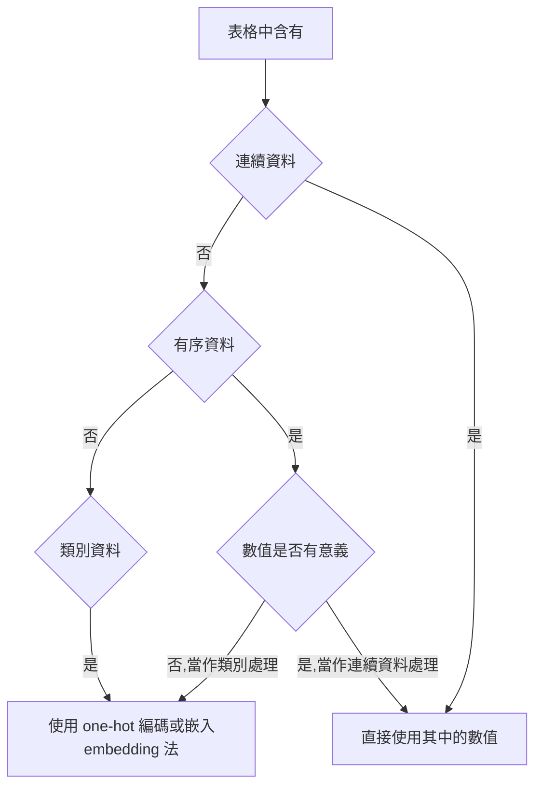

# pytorch
[參考原始碼](https://github.com/deep-learning-with-pytorch/dlwpt-code)
## 初始化
建立 conda env 和 activate:
```bash=
conda create --name pytorch python=3.6.8
conda avtivate pytorch
#移除環境
conda env remove --name pytorch
```
安裝套件:
```bash=
pip install -r requirements.txt

conda install pytorch torchvision torchaudio cudatoolkit=11.1 -c pytorch -c conda-forge

conda install h5py
```

開啟 Jupyter Notebook:
```bash=
Jupyter Notebook
```

開啟 tensoboard:
```bash=
tensorboard --logdir python_file/luna/runs/log
```

## pytorch 常用函式庫
- 建構神經網路的核心模組位於 torch.nn 中，常見的有:
    - 完全連接層( fully connected layers )
    - 卷積層( convolutional layers )
    - 激活函數( activation functions )
    - 損失函數( loss functions )
- 載入和處理資料時，torch.util.data 是個好用的工具，主要有兩個類別(class)分別為:
    - Dataset，是連接使用者資料(任何格式的資料)和標準 PyTorch 張量的橋樑
    - DataLoader，他可以在後台生成子程序( child process )，並從資料集中在入資料
- 使用多個GPU或者讓多台機器同時訓練模型，可用 torch.nn.parallel.DistributedDataParallel 和 torch.distributed 來利用額外的硬體資源
- torch.optim 提供了優化模型的標準方法
- dtype 總覽:
    - torch.float32 or torch.float:32位元的單精度浮點數 (預設
    - torch.float64 or torch.double:64位元的雙精度浮點數
    - torch.float16 or torch.half:16位元的半精度浮點數
    - torch.int8:8位元的整數
    - torch.uint8:8位元的正整數
    - torch.int16 or torch.short:16位元的整數
    - torch.int32 or torch.int:32位元的整數
    - torch.int64 or torch.long:64位元的整數
    - torch.bool:布林值
- 常見 tensor 的操作:
    - Creation:用來創建張量的函式，ex: zeros(), ones()
    - Indexing、Slicing:用來改變張量的 shape 或內容的函式，ex: transpose()
    - Math:可以對張量數值進行運算的函式
        - Pointwise:對每一個元素進行轉換，並得到一個新張量，ex: abs()、cos()
        - Reduction:以迭代的方式對多個元素進行運算，ex: mean()、std()、norm()
        - Comparision:對張量內的元素值進行比較，ex: equal()、max()
        - Spectral:用來在頻域(frequency domain)和時域(time domain)中進行轉換和操作的函式，ex: stft()、hamming_window()
        - BLAS、LAPACK:BLAS代表基礎線性代數程式集(Basic Linear Algebra Subprograms)，LAPACK則代表線性代數套件(Linear Algebra PACKage)，它們專門用來處理純量、向量及陣列間的操作
        - 其他操作:特殊用途的函式，ex: 針對向量的cross()、針對矩陣的trace()
    - Random sampling:透過不同的機率分布進行隨機取樣，可用來生成亂數，ex: randn()、normal()
    - Serialization:用來讀取與儲存張量的函式，ex: load()、save()
    - Parallelism:在CPU的平行處理中，用來控制執行敘數量的函式，ex: set_num_threads()
    - 函式若結尾有 _ ，表示該方法為 in-place 操作，會直接修改記憶體內的值，而不是複製一份原始資料，處理後再傳回新張量
    - scatter_ 有 3 個參數:(常用來製作 one-hot)
        1. 要沿著哪個軸進行 one-hot 編碼( 1代表第 1 軸)
        2. 要進行 one-hot 編碼的來源張量(張量內的值表示 target_onehot 中哪一個索引位置要被設為非 0 的值)
        3. 設定 one-hot 編碼中非 0 的值為多少，通常是 1
        - 總結: 對於每一列，取目標標籤(就是第 2 個參數所指定的張量，在以上例子中，即個別樣本的品質分數)的值作為 one-hot 向量中的索引，設置相應值為 1.0
        - !! 來源張量(第二個參數)的軸數，必須與我們散佈(scatter)到的結果張量(target_onehot)相同，
        - 由於 target_onehot有兩個軸(4898x10)因此要用 unsqueeze() 將 target(1軸向量)增加 1軸
        ```python=
        #example:
        target_onehot = torch.zeros(target.shape[0], 10) #建立 shape 為 [4980, 10]，值均為 0 的張量，用來存放編碼結果

        a = target_onehot.scatter_(1, target.unsqueeze(1), 1.0) #依 target 的內容進行編碼
        ```
    - requires_grad:
        - 使用 requires_grad=True 後，PyTorch 會追蹤由 params 相關運算所產生的所有張量
        - 只要某張量的母張量中包 params，那麼從 params 到該張量之間所有的運算函數便會被記錄下來 
        - 假設這些函數皆可微分，那其導數變會自動地存入 params 張量的 grad 屬性之中
- loss.backward: 反向傳播
    - 呼叫 backward() 後，導數會被累加到葉節點的 grad 中
    - 假設我們先呼叫 backward() 一次、重新評估損失、然後再呼叫一次 backward()，則兩次呼叫 backward()的梯度會被相加，進而產生錯誤的結果
    - 為避免上述的問題，必須在每次訓練迴圈完成後，將梯度歸零
- with torch.no_grad():.
    - PyTorch autograd 不會在 with torch.no_grad() 區塊中運作，因此會將 with 內的運算過程加到運算圖中
    - 因此在下個回全建立新的前向運團前，不要更動到運算圖的內容，因此須將相關的城市放在 with torch.no_grad(): 中
- optim:
    - 每個優化器建構函式的第一個參數都是 內涵模型參數的張量，且該張量的 requires_grad 通常設為 True
    - 每個優化器有兩個 method: 
        - zero_grad(): 可以將所有參數張量的 grad 屬性歸零
        - step(): 可以根據優化器自身的優化策略來更新數值
- Dataset 
    - 包含兩個 method:
        - `__len__`要能傳回資料集中有多少筆項目
        - `__getitem__`可用來存取特定元素的資料，其中包含元素本身及其相應的標籤(答案，為整數索引) => (feature, label)
    - 若 `__len__` 的傳回值為 N，則對於從 0 到 N-1 的輸入值，`__getitem__`都必須傳回有意義的結果
- IterableDataset 為一進階工具，當資料集的隨機存取(random access)代價很高或不可用時，就可以使用它
- Subset: 當只需以索引值來取出資料集的子集(subset)，可使用 Subset
- ConcatDataset 能把擁有相容元素的多個資料集合併起來
- ChainDataset 可以協助建立可迭代的(iterable)大型資料集
- DataLoader:
    - 四個常見的參數:
        1. dataset 的物件
        2. batch_size，批次量
        3. num_workers，CPU 的核心數
        4. pin_memory，bool 鎖定記憶體
    ```python=
    train_dl = DataLoader(
        train_ds,
        batch_size=batch_size, #批次量
        num_workers=self.cli_args.num_workers, #運算單元的數量
        pin_memory=self.use_cuda, #鎖定記憶體 (pinned memory) 可以快速轉移至 GPU
    )
    ```
    - 可透過獨立的**程序**(process)與共享記憶體實現資料的**平行載入**。只要在創建 DataLoader 物件時指定 num_workers 參數，相關工作便會自動在背景完成。
- 分類問題的 loss:
    - 就數學上來說，將 nn.LogSoftmax 和 nn.NLLLoss 一起使用的效果相當於 nn.CrossEntropyLoss
    - nn.NLLLoss 計算交叉熵時所用的輸入為對數化機率，而 nn.CrossEntropyLoss 的輸入則是未經 softmax 或 LogSoftmax 處理的預測分數(又稱為 logits)
    - 就技術上來說，nn.NLLLoss 估算的是**狄拉克分布**(Dirac distribution;即所有機率值量落在一種可能性上)與模型預測分布(以對數化機率作為輸入計算而得)之間的交叉熵
    - 在資訊理論中，交叉熵可被理解為:在以目標分佈作為期望輸出的情況下，以模型預測分佈的負對數化概似率
    - 因此上述 nn.NLLLoss 和 nn.CrossEntropyLoss 都能視為:利用給定資料做出機率預測(結果經過 softmax 處理)時，模型參數的負對數化概似率
- torch.nn:
    - 卷積工具:
        - 1D: nn.Conv1d(用於時間序列資料)
        - 2D: nn.Conv2d(用於圖片)，(輸入通道數, 輸出通道數, 卷積核大小)
        - 3D: nn.Conv3d(用於體積或影片)
    - 自己建立的 nn.Module 的子模組必須是位於最頂層的屬性(attribute)，不能被包裹在 list 或 dict 中，否則，優化器將無法追蹤到子模組的位置以及參數。如果非得以 list 或 dict 的形式書褥子模組，請使用 PyTorch 提供的 nn.ModuleList 和 nn.ModuleDict
    - nn.Dropout:
        - 要放在**非線性激活函數**與**下一層線性或卷積層**之間
        - 需要一個機率值引數，代表每個神經元被丟棄的可能性
        - 以卷積神經網路來說，要使用特製的 nn.Dropout2d or nn.Dropout3d，他們可以針對不同輸入通到的資料進行隨機丟棄
    - nn.BatchNorm:
        - 根據輸入資料的軸數，選擇以 nn.BatchNorm1d、nn.BatchNorm2d、nn.BatchNorm3d 模組來實現批次正規化
        - 其目標在於改變輸入激活函數的數值，所以應該將其放置在線性變換(卷積層 or 線性層)後，激活函數之前
- eval() vs no_grad():
    - model.eval(): 主要用於通知dropout層和batchnorm層在train和val模式間切换
        - 在train模式下，dropout網路層會按照設定的參數p設置保留激活單元的概率（保留概率=p); batchnorm層會繼續計算數據的mean和var等參數並更新。
        - 在val模式下，dropout層會讓所有的激活單元都通過，而batchnorm層會停止計算和更新mean和var，直接使用在訓練階段已經學出的mean和var值。
        - 該模式不會影響各層的gradient計算行為，即gradient計算和儲存與training模式一樣，只是不進行反向傳播（backprobagation）
    - with torch.no_grad(): 主要是用於停止autograd模塊的工作，以起到加速和節省記憶體的作用，具體行為就是停止gradient計算，從而節省了GPU算力和顯存，但是並不會影響dropout和batchnorm層的行為。
- DataParallel vs DistributedDataParallel:
    - DataParallel 相當於即插即用的模型包裹器 (wrapper)，適用於在單一機器上實現多 GPU 的利用
    - DistributedDataParallel 適用於將運算任務分配給多個 GPU、多台機器執行，但設置相當複雜
- model.to('cuda') 要在創建 optimizer 之前，否則 optimizer 會去 cpu 找 model 的參數

## 筆記
- 利用深度學習來完成任務需要的條件:
    1. 找到能處理輸入資料的方法
    2. 定義深度學習機器(或稱為模型)
    3. 找到能進行訓練以及萃取特徵，並讓行輸出正確答案的自動化方法
- 為了訓練模型需要準備的東西:
    1. 一組訓練資料集
    2. 一個可根據【訓練資料集】去調整【模型參數】的優化器
    3. 一個將模型和資料與硬體整合，並利用硬體來進行訓練的方法
- 張量:
    - 張量中的數值被置放於連續的記憶體區塊中，以一個 storage 為一個幾本儲存單位
    - 一個 storage 儲存了包含數值資料的 1軸連續陣列，可為 float32、int64 ......
    - 張量是用來呈現 storage 的視圖(view)，它讓我們能依照偏移量(offset)和步長(stride)來索引 storage 的內容
    - 張量能用多種方式對同一個 storage 進行索引，進而產生不同的張量，ex: 對同為1維陣列的 storage，分別以 (3, 2) (2, 3) 等不同 shape 來取用它，則會產生不同的 shape 的 tensoe 
- 要對 storage 進行索引，張量必須一類一些和 storage 相關的資訊:
    - 大小(size)(在 NumPy 中稱為 shape):
        - 是一個 tuple，表示張量在軸上有多少元素
        - ex: (列, 行) => (2, 3)，表示 有2列，每一列3個元素
    - 偏移(offset)
        - 是張量中首個元素在 storage 中的索引值，預設是 0
        - ex: offset=1，則張量的首個元素在 storage 中索引為 1
    - 步長(stride)
        - 是在提取各軸的下一個元素時，需要跳過的元素數量
        - ex: stride = (3, 1)，表示 +3 => next row，+1 => next col
    - 要知道索引(i, j)的元素在 storage 中的索引值，可透過以下取得:
    ```python
    storage_offset + stride[0] * i + stride[1] * j
    ```
    - 張量和 storage 的間接轉換讓一些操作(ex: 轉置張量或提取子張量)變得方便，因為記憶體無需重新分配，透過修改大小、偏移、步長產生一個新的張量
    - 轉置的概念就是 步長 x,y => y,x 交換
- PyTorch 與 NumPy 的互通性:
    - 使用 numpy() 轉換後會回傳一個與 points 相同 shape 和內容的 Numpy 多維陣列
    - 這個 NumPy 陣列會跟張量共用同一個底層記憶體
    - 若修改了 NumPy 陣列中的內容，原本的張量內容也會一起修改
    - 若張量是存放在 GPU 中，PyTorch 會把內容複製一分到 CPU，並把資料型別轉換為 NumPy  陣列
    - PyTorch 張量預設型別為 32位元浮點數，而 NumPy 則是 64位元浮點數，引此轉換後要留意 dtype
- PyTorch 要求圖片資料張量的軸順序為 **N(圖片張數 batch) X C(色彩通道) X H(高度) X W(寬度)**
- 若將 label 定為整數，並且做迴歸分析，適用於 label 間是可以比大小的，這也代表分數間有固定的距離，如果資料是以距離來劃分，這種方法就很適合
- 若目標資料是離散型，那 one-hot 編碼更適合，因為這種方法沒有順序或距離的概念，若目標資料中的小數可以省略，one-hot編碼也是一種適當的做法
- 資料類別:
    - 連續數值:有序的(可以大小的)，不同數值間具有明確的大小關係，且可用比例關係來呈現
    - 有序數值:彼此間具有大小關係，但數值間的間隔未必是固定的尺度了，僅代表測量值的大小差異，但無法表示出相差多少
    - 類別數值:無法排序，彼此間也沒有數值關聯性，只是用一個編號代表某一種類別

- 標準化後的訓練資料 (data - torch.mean(data)) / torch.std(data)
    - 變數平均數會是 0(將所有值都減掉平均值，就等於把平均值移到 0)
    - 標準差會是 1
    - 如果我們的變數符合常態分布，那轉換後將有 68% 的樣本值介於 [-1.0, 1.0]之間
- 只要 one-hot 編碼變得繁瑣，就可以考慮改用嵌入法來處理，它能有效地代替 one-hot 編碼，利用包含嵌入向量的矩陣進行運算
- 詞嵌入法(Text embedding):
    - 以單字為例，我們可以為每個單字隨機生成一個 100 維的浮點數向，但這會忽略掉單字和單字的之間的相關性
    - 因此要把常一起使用的單字，投影到向量空間中的相近區域
- 機器學習的標準流程:
    1. 給定輸入資料與期望輸出(即真實輸出，英文為 ground truth)，以及模型的初始參數(即權重)
    2. 模型會根據輸入資料輸出一個預測結果
    3. 透過損失函數來計算預測值與真實值之間的誤差(即損失，loss)
    4. 模型計算參數改變時所造成的誤差變化量(梯度)，此方法是利用連鎖法則(chain rule)由後往前對美依神經層的函數求導數(反向傳播，backpropagation)
    5. 模型參數朝著讓誤差變小的方向更新
    6. 以上流程不斷重複，
- 權重(weight)告訴我們輸入對於輸出的影響程度有多大；而偏值(bias)則決定當所有輸入皆為0時，輸出值等於多少
- 張量擴張(Broadcasting)，當兩個 tensor 互相加減乘除時的規則
    - 檢查每一個軸，若某個軸的維度為 1(只有一個元素)，則 PyTorch 會將此元素與另一張量對應軸上的每個元素分別進行運算
    - 若兩張量中對應軸的維度皆大於 1(都有多個元素)，則它們的大小**必須相等**，此時該軸中的元素自然就可與另一張量中對應位置的元素進行運算
    - 若某張量的軸數多於另一仗量，則另一張量會和此張量多出軸中的每個元素進行運算。例如A、B張 shape 分別為 [2, 3]、[3]，則B中的元素會分別A[0]及A[1]進行運算
- 訓練集和驗證集(training set and vaildation set):
    - **訓練損失**(training loss)代表模型是否能你和訓練集中的資料，也就是該損失會顯示模型是否有足夠的容量(capacity，即足夠的參數)來處理訓練資料中的關鍵資訊
    - **驗證損失**(validation loss)若沒有隨著訓練損失一起下降，則代表模型只擬合了訓練時所看到的樣本，辦並未將所學**普適化**(generalize，又稱 泛化)到訓練集以外的資料上
    - 因此能總結兩個規則:
        1. 若訓練損失沒有呈現下降趨勢，則模型可能太過簡單
        2. 若訓練損失和驗證損失差距很大，則可得知模型發生**過度配適**(overfitting)
- 解決過度配適的關鍵為: 讓模型在訓練資料以外也能表現良好，因此我們能做的幾件事:
    1. 確保取得足夠多的訓練資料
    2. 讓模型對訓練資料的表現盡可能**常規化**(regilarization)
        - 可在損失函數中加入**懲罰項**(penalization terms)，進而在一定程度內使模型變化更為緩慢、行為更加平順(就是當神經層的參數值越大則給予越大的懲罰，以限縮其變化範圍)
        - 在輸入樣本中加入雜訊，相當於人工產生訓練資料以外的新數據，並強迫擬合
        - 最好的一步: 讓模型變得簡單
    - 在訓練完成後，重點在: 訓練損失和驗證損失是否**皆呈現下降趨勢**
    - 通常只要訓練損失和驗證損失的差異不要太大，我們就有理由相信模型正持續從資料中學習到普適化的特徵
- 因此必須取捨(trade-off):
    - 模型的容量必須夠大，才能擬合訓練集
    - 又要避免過度配適的發生
- 為了找出網路合適的大小，可使用以下**兩階段的流程**:
    1. 嘗試以較大容量模型進行訓練，直到擬合資料為止
    2. 在可擬合資料的狀況下，儘量縮小模型以減少其過度配適
- 一個神經元(neuron)，做的事為:
    - 對輸入進行一次**線性變換**(linear transformation，例如:先將輸入乘以**權重**weight，然後再加上**偏值**bias)後，在套用一個非線性函數(稱為**激活函數**，activation function)
- 激活函數
    - 扮演兩項重要的功能:
        1. 讓模型的斜率一輸入資料而變動，只要有技巧地調整模型內各輸出值的斜率，神經網路便能模擬出任何複雜或奇特的函數
        2. 激活函數能將神經網路最後一層的輸出限制在特定範圍內
    - 2個常見的特性:
        1. 必須是**非線性**的。重複多個線性變換(w*x+b)的結果仍是線性變換，只有加入非線性的激活函數，神經網路才能模擬更加複雜的函數行為
        2. 必需是**可微分的**，這樣才能計算梯度，只在幾個點上無法微分(如: Hardtanh or ReLU)是可以接受的
    - 以下兩點為真:
        1. 這些函數包含至少一個敏感區域。在此區域內，輸入值的細微變動會造成輸出值的顯著差異
        2. 許多函數還包含非敏感(或飽和)區域。輸出值幾乎很少，或不會隨著輸入值的變化而有顯著改變
    - 絕大多數的激活函數還具有以下特性:
        1. 當輸入接近負無限大時，輸出趨近於(或達到)某個下限值
        2. 當輸入接近正無限大時，輸出趨近於(或達到)某個上限值
- 線性 + 激活函數，可以建立強大的神經網路架構，此種網路具有以下特色:
    1. 網路中的不同神經元會對相同輸入產生不同程度的反應
    2. 輸入所產生的誤差主要影響在敏感區域中運作的神經元、其他神經元則較不影響
- 對神經網路而言:
    - 成功完成一項任務的定義為:在經過乙訓練資料為基礎的學習後，模型能對未曾見過(但與訓練資料性質相同的)的輸入產生正確輸出
    - 深層神經網路賦予我們:在不假設任何模型的情況下，模擬出高度非線性函數
    - 利用樣本資料使模型能夠完成特定任務的過程即為**學習**
    - 在深度學習的技術中，我們犧牲了可解釋性以換取解決複雜問題的可能性
- 將資料組成 batch 的理由:
    - 確保最大化地利用運算資源。GPU是高度平行的。
    - 一些進階模型會用到多筆資料的統計資訊。當 batch 中的資料越多，模型能得到的數據也越充足
- softmax:
    - 公式相當於: 先對向量中每個元素 x 指數化(e 的 x 次方)，再將個別 e 的 x 次方的結果，除以所有 e 的 x 次方的總和
    - 其是個**單調函數**(monotone function)，這表示輸入值越小，對應到的輸出值也越小
    - 其沒有**縮放不變性**(scale invariant)，因此輸入元素之間的比值和對應輸出元素的比值不一定相同。但在實際使用上，比值的改變不會產生任何不良影響，模型會在訓練過程中找到最適當的比值
- 沿著軸運算:
    - 沿著某一軸運算的意思就是，其他軸索引固定、取某一軸的所有元素算一次。
    ```
    x = torch.tensor([[1.0, 2.0, 3.0], #沿著第 1 軸就是橫列方向
                      [1.0, 2.0, 3.0]])
                       #沿著第 0 軸就是直行方向
    ```
- 分類任務的損失:
    - 想要最大化**正確類別**的機率，又稱為**概似率**(likelihood)
    - 期望在概似率很低時，損失函數的輸出要很高；在概似率很高時，損失值要越低。
    - 負對數概似率(negative log likelihood, NLL)，剛好符合我們的需求:
        - `NLL = -sum(log(out_i[c_i]))`
        - 其中 c_i 代表第 i 樣本的類別標籤、sum 表示將全部 N 個樣本的結果加總
    - 對批次中的每一個樣本而言，分類任務的損失可以透過以下方式計算:
        1. 以前饋方式運作神經網路已獲得最後一層線性層的輸出
        2. 對最後一層輸出套用 softmax，將輸出轉換成機率
        3. 把對應到正確類別的機率值單獨取出(即概似率)。
        4. 將上述概似率取對數後加上負號便成為損失
- 常見的幾種訓練迴圈:
    - 利用資料集中所有樣本的累積結果更新模型:
    ```
    共 N 個訓練週期，每次執行以下事件:
        針對資料集中的每一個樣本:
            評估模型(前向運算)
            計算損失
            累積損失梯度(反向運算)
    利用累積的梯度結果更新模型
    ```
    - 利用每個單一樣本更新模型:
    ```
    共 N 個訓練週期，每次執行以下事件:
        針對資料集中的每一個樣本:
            評估模型(前向運算)
            計算損失
            計算損失梯度(反向運算)
            利用累積的梯度更新模型
    ```
    - 利用小批次中所有樣本的累積結果更新模型:
    ```
    將資料集切分成小批次
    共 N 個訓練週期，每次執行以下事件:
        每一個小批次:
            針對資料集中的每一個樣本:
                評估模型(前向運算)
                計算損失
                累積損失梯度(反向運算)
        利用累積的梯度結果更新模型
    ```
- 隨機梯度下降(SGD, stochastic gradient descent):
    - 將資料洗牌後，抽取小批次的樣本進行處理
    - 利用小批次資料的梯度來更新參數，能有效促進模型收斂、並防止優化程序卡在區域最小值上
- 全連接神經網路不具備**平移不變性**(translation invariance):
    - 具體來說訓練後的網路或與能辨識圖片(4, 4)上的飛機，但相同飛機在(8, 8)位置時卻無法辨認
    - 為了解決上述問題，需要**擴增**(augment: 如在訓練過程中，對訓練集圖片進行隨機位移)資料集
    - 注意，必須對所有的圖片執行擴增(可用 torchvision.transforms 將為移後的結果串在一起)
    - 採取**資料擴增**(data augmentation)策略需要付出代價:神經網路的隱藏層特徵數必須足夠龐大，以便學習來自所有圖片的訊息
- 卷積(精確地說是**離散卷積** discrete convolution):
    - 被定義為: 權重矩陣(又稱為**核** kernel)與相鄰像素之間的純量積
    - 求核和圖片間的純量積(核以外的位置對應權重為0)=>**保留區域特徵**
    - 以相同的核權重處理整張圖=>**維持平移不變性** 
    - 若圖片具有多通道(ex: RGB)，則卷積核權重矩陣會改為 3x3x3 的陣列，每個通道各自對應一組權重(3x3)，且 3 個通道的權重矩陣會共同影響輸出值
    - 卷積操作就等於在進行線性操作時，將**圍繞在特定像素周圍**以外的所有權重皆設為0，並只讓未設為0的權重隨著模型訓練而更新
    - 因此有以下好處:
        - 可針對鄰近像素進行區域化處理
        - 維持平移不變性
        - 模型參數數量顯著減少
    - 參數減少的原因: 決定卷積層參數數量的因素不是圖片的像素總數，而是卷積核的大小(ex: 3x3)以及模型所用的卷積核(又稱為**過濾器**，filters)總數(或者輸出通道數，也就是有多少卷積核就會輸出多少個通道的資料)
- 填補(padding)邊界:
    - 若核的大小為奇數(ex: 3)，則輸出圖片的上下左右就會各少掉卷積核大小的一半(3//2=1)
    - 若核的大小為偶數，則需分別在上下左右填補不同數量的像素。PyTorch 提供的卷積模組無法進行這樣的處理，只能透過函式 torch.nn.functional.pad 來完成，因此應盡可能使用奇數大小的核
    - 可對圖片的邊緣進行填補(padding)，進而產生數值為零的**幽靈像素**
    - 無論是否進行填補，weight 和 bias 的大小都不會受到影響(填補影響的是輸出圖片的大小)
- 深度與池化:
    - 由於卷積核都很小，可能導致對整體的訊息被忽略
    - 因此會把多層卷積層疊在一起，並在兩個連續的卷積處理之間對圖片進行 downsampling(降採樣)
- downsampling(降採樣):
    - 有很多種實現方法，ex: 將圖片大小縮成原本的一半，相當於，輸入原圖中的**4個相鄰像素**(2x2的區域)，並輸出**1個像素值**
    - 以下是常見的作法:
        - 取輸入像素的**平均值**。**平均池化**(average pooling)的方法在早期相當常見，但最近已經越來越少人用
        - 取輸入像素的**最大值**。**最大池化**(max pooling)是目前使用平率最高的方法，但其缺點為: 會丟失其餘像素的資訊
        - **特定步長**的卷積處理(即每隔 N 個像素材採納計算)。目前尚未好到取代最大池化
    - 由於池化後會將一個大區塊的資訊濃縮，假設池化的區域為 2x2，也就是輸入 4 個像素，輸出 1 個像素，因此在池化後的卷積層一個 filter 能看到 4 倍的資訊
- upsampling(升採樣):
    - 此技術能增加圖片的解析度，最簡單的方法為: 將輸入中的每個像速擴充為 NxN 的像素區塊，且該區塊中各像素的值等於輸入的像素值
    - 其他複雜的方法: **線性內插法**(linear interpolation)、**學習式反卷積**(learned interpolation)
- 在分類任務中，神經網路的主要目標為**壓縮資料**: 原本由眾多像素組成的圖片資料，經壓縮後變成了由**幾個機率值所構成的向量**(每個機率值對應不同類別)，其中模型通常有兩個特徵:
    1. **資料壓縮**透過模型的**中間層維度逐步降低**來反映，可以看到:離輸出越近的層的卷積層通道數越少(同時池化層也會減少像素數量)，且線性層的輸出維度比輸入維度來的小。
        - 在一些熱門的架構(ex: ResNets)，雖然資料的空間解析度一樣會因池化而減少，但通道數量卻是不斷上升的(綜合來說，資料的大小仍會下降)。對於大型圖片來說，需要堆疊更多層的神經網路，維度降低的速度一般會更慢。
    2. 只有在第一卷積層中，輸出維度並未小於輸入維度。網路中的第一個層是例外，其會使資料的整體維度顯著上升
        - 核技巧(kernel trick): 先將資料投射到高維空間，在進行概念上(較線性學習)更加簡單的機器學習
- 當神經網路很簡單時，傾向使用模組和 nn.Sequential；當我們需定義自己的前向運算時，選擇函數式介面來操作那些不需內部參數狀態的層
- 在神經網路的**量化**(quantization)中，由於需捕捉與量化有關的訊息，這項作業會使一些本來不用內部狀態的元件(如: 激活函數)突然需要內部狀態。
- 若模型要用到多個無內部狀態的模組(ex: nn.HardTanh or nn.ReLU)，那最好在每次用到他們時都產生一個**獨立的物件**，重複利用相同的模組不會發生問題且較有效率，但模組分析工具卻有可能因此而出錯
- 將 PyTorch 運用到實務上，應該具備的**重要概念**:
    - **增加模型的記憶容量: 寬度**
        - 網路的**寬度**(width): 每一層的神經元數量，或者每個卷積層中的通道數
        - 增加模型寬度:
            1. 把卷積層的輸出通道數調高，再相應地調整之後神經中的通道數即可
            2. 由於全連接層所接收到的向量長度增加了，因此 forward 函式也要記得調整
        - 模型的容量越大，就越能應付輸入資料中的變異性；大量的參數使模型更容易記得輸入資料中無關緊要的訊息，所以**過度配適**現象也會越明顯
        - 解決過度配適的最佳方法是**增加樣本數**，倘若無法取得新資料，則可用人工方式對既有資料進行擴張
    - **協助模型的收斂與普適: 常規化(Regularization)**
        - 模型的訓練設及兩個關鍵步驟: 
            1. **優化**(optimization；使用訓練資料讓模型損失下降)
            2. **普適化**(generalization；模型將所學推廣到訓練及以外的新資料，如驗證集資)廖
        - **常規化**(Regularization): 即最常用來完成這兩個步驟的數學工具
        - **約束模型的參數: 權重懲罰機制(weight penalties)**
            - 提升普適效果的第一種方法是: 在損失中加入**懲罰項**
            - 加入後，模型會隨著訓練而變大的幅度會受限，進而將權重值維持在低點，也就是說，該項會懲罰**較大的**權重值
            - 該方法能使損失值的變化更加平滑，並降低適配個別樣本所引起的參數改變
        - 最常見的常規化有**L2常規化**(取模型權重的**平方和**)及**L1常規化**(取模型權重的**絕對值總和**)，兩者皆需乘上一個小因子 lamda，該因子為訓練前設定好的超參數之一
        - L2常規化也被稱為**權重衰減**(weight decay)。
            - 在 SGD 及反向傳播裡，某參數 w_i 的 L2懲罰項為`-2 * lambda * w_i`(權重的平方為 w_i^2，其導數取負號後為 `-2 * w_i`，最後在乘上一個小因子 lambda )
            - 其意義相當於: 每次優化時，不管是要調升或降低權重，都會再額外將權重減少一點，而且減少的量與當前的權重值成正比，L2常規化因此得名權重衰減
            - 此衰減會套用到神經網路的所有參數，包括偏值
        - **避免過度依賴單一輸入資料: 丟棄法(Dropout)**
            - 在每次訓練過程中，隨機將一部分的神經元的輸出歸零(相當於 丟棄 這些神經元的輸出資料)
            - 原理有很多種說法:
                - 此方法能在每回合訓練中，有效使模型的神經元拓樸(topology)結構產生些許差異，進而避免造成在過度配適時會發生的記憶效應
                - 丟棄法能在模型所產生的特徵中加入干擾，其效果類似於資料擴增，只不過作用範圍擴及整個網路
        - **約束激活函數: 批次正規化(Batch Normalization)**
            - **批次正規化**(Batch Normalization)技術能對訓練過程產生多種效益:
                - 允許我們使用更高的學習率
                - 降低訓練效果對初始化的依賴程度
                - 發揮如常規化作用器的效果
            - 因此成為了丟棄法的替代方案
            - 主要原理: 重新調整輸入資料的數值分布，以避免輸入的小批次資料落入激活函數的飽和區域
            - 從技術上來說，批次正規化會根據小批次樣本的**平均值**與**標準差**來平移模型中間層的輸入，並調整這些輸入的規模
                - 平移是對所有輸入值**加上**一個常數；規模調整則是**乘上**一個常數。簡單講就是減平均值然後在除以標準差
            - 此方法之所以會產生常規化的效果，是由於我們持續根據小批次資料(由隨機樣本組成)的統計資訊來正規化(平移或規模調整)該批次中的每一筆資料，這相當於是一種**有原則的**(princioled)擴增法
            - 作者宣稱批次正規化能消除(或至少降低)模型對丟棄法的需求
    - **深入探索更複雜的結構: 深度**
        - 網路的深度越深，能擬合的函數複雜度也越高
        - 深度上的擴張使模型能處理**有階層關係**的資訊，並掌握需要脈絡才能理解的輸入資訊
        - 增加模型深度相當於讓神經網路對輸入進行更多層的解析
        - **跳躍連結(skip connection)**
            - 提高模型深度通常會增加訓練收斂的難度
            - 過長的乘積鏈將使得某些層的梯度**消失**(vanish)，進而導致這些層的參數無法被適當的更新，模型訓練因此無效
            - **殘差網路**(residual network, ResNets): 利用**跳躍連接**(skip connection，或稱為殘差連接)在層與層之間建立另一條迴路
            - 跳躍連接的功能就是在非相鄰的神經層之間加入額外的連接
            - 跳躍連接的過程有可以稱為**恆等映射**(identity mapping)
            - 從反向傳播的角度思考: 在深度網路中設置一或多個較遠距離的跳躍連接，相當於在遠距的神經層之間多建立了一條直達通道
            - 在進行遠距的反向傳播時，便可以減緩因進行大量倒數及乘積操作所造成的問題，進而更直接地傳遞部分損失梯度到較遠的神經層
- 在區分訓練與驗證集的**注意事項**:
    - 兩個資料集中的樣本必須具有**代表性**，且是平均分布的
    - 除非特殊目的(ex: 要訓練能處理離群值的模型)，否則不要將不具代表性的樣本放入訓練和驗證資料集中)
    - 訓練集不應該存在與驗證集有關的暗示(ex: 某個樣本同時出現在兩個資料集中，這被稱為**資訊洩漏**)
- 當資料解析與匯入的成本很高時，可以考慮使用***快取**
    - 某些快取可以在記憶體中處理，某些則應該透過硬碟來完成
    - 在資料匯入的一連串程序中，兩種塊取各自有不同的發揮空間
- 評估指標
    - **偽陽性**(false positive): 對於**非關鍵物體**產生反應的情形
    - **真陽性**(true positive): 模型正確地標記出我們感興趣的物體
    - **偽陰性**(false negative): 某物雖被判定為無關緊要，但它其實正是我們在找的目標(陰性的意思是想找的東西沒出現)
    - **真陰性**(true negative): 被判定為不重要的東西就**真的不重要**
    - **召回率**(又稱**敏感度**(sensitivity)，或查全率)
        - 意旨 不要錯過任何陽性事件，又為**最大化真陽性**的能力
        - 即 真陽性 和 真陽性與偽陰性之**聯集**(也就是所有標籤為陽性的樣本集合) 之間的比率(召回率=真陽性/(真陽性+**偽陰性**))
        - 偽陰性越少，召回率越高
    - **精確率**
        - 意旨 只反應**確定為陽性**的狀況，又為**最小化偽陽性能力**
        - 即 真陽性 和 真陽性與偽陽性之聯集 之間的比率(精確率=真陽性/(真陽性+**偽陽性**))
        - 偽陽性越少，精確率越高
        - 有多少被判定為陽性的樣本屬於真陽性
    - 若訓練中，召回率與精確率任何一個降至零，則可推測: 模型的行為即有有可能發生了退化，此時便需要留意模型表現的細節，以便找出問題並讓訓練重回正軌
    - **偽陽性比率**(false positive rate, FPR)
        - FP / (FP + TN)
        - 有多少真實陰性的樣本被誤判為陽性
    - **真陽性比率**(true positive rate, TPR)
        - TP / (TP + FN)
    - **F1分數**(屬於**調和平均數** harmonic mean)
        - 能反映出訓練或模型的改變對模型整體表現有何影響
        - 用途極廣，能結合精確率(precision)和召回率(recall)的方法
        - 公式:
            $$
                2*precision*recall \over {precision+recall}
            $$
        - 範圍落在 0(分類器完全沒有實用價值)到 1(分類器擁有完美預測能力)
        - 傾向於讓精確率和召回率**均衡發展**，這正是模型評估指標應具備的性質
    - 將精確率與召回率結合的其他方法補充:
        - 平均法(**算術平均** arimetic mean):
            - 將精確率與召回率兩者平均
            - 這樣會導致 avg(p=1.0, r=0.0) 和 acg(p=0.5, r=0.5) 的得分皆為 0.5
            - 因為精確率或召回率為零的分類器通常毫無價值可言，然而上述的例子導致兩者都為0.5分，因此平均法無法成為有效的評估指標
            - 訓練前期只專注於召回率或精確率單一的提升，再想辦法提升另外一種
        - 取最小值法
            - 取精確率和召回率的最小值
            - 當精確率和召回率任一為 0 時，則表現是最差的；若想獲得最佳表現，兩者皆必須提升至 1.0 才行
            - 但若固定精確率在 0.5，則召回率不管提升至 0.6 0.7，模型的評估分數都不會改變
            - 此指標鼓勵模型在精確率和召回率之間取得平衡，但無法忠實呈現所有數值變化的細節，而模型評估指標應該要能反映出所有變化才對
        - 相乘法(類似取**幾何平均** geometric mean):
            - 將精確率和召回率相乘
            - 此作法保留了: 兩比率任一為 0 時得分為 0，且只有兩比率接完美才能為 1.0。 的理想性值 
            - 當比率值很小時，相乘的做法也能驅使模型平衡精確率和召回率
            - 隨著兩比率的數值增加，此指標的行為會越來越**線性**(也就是 只有一方增加 1.0 和 兩方皆增加 0.05 的結果相近)，這不利於我們維持精確率和召回率的同步上
- 訓練集內的陽性及陰性樣本**數量一致**(即進行平衡操作)有助於提升模型表現
- 資料擴增(Data Augement):
    - 將既有資料轉換為新資料，且後者不但要保持類別代表性(即保持某類別之普適特徵)、又得在可記憶的細節上與原本不相同
    - 5種擴增技巧:
        - 將影像資料上下、左右或前後**翻轉**
        - 將影像資料**平移**幾個體素(or 像素)
        - 將影像資料**放大**或**縮小**
        - 做影像**旋轉**
        - 在影像中加入**雜訊**
    - 在資料處理流程中，**產生快取**的步驟要在**資料擴增**之前，否則影像會保留在擴增厚的狀態
    - 在資料有限的情況下，該技巧能減緩**過度配適**的狀況
- 不同類型的資料分割:
    - **語意分割**(semantic segmentation):
        - 利用類似餘分類任務中的標籤來標記**每個像素**的所屬類別
        - 經上述處理，資料中的特定區域會被凸顯出來，且模型會告訴我們標住起來的區域是什麼
        - 這種凸顯是透過**標籤遮罩**或**熱圖**(heatmap)來實現
    - **實體分割**(instance segmentation):
        - 其不只會標出物體類別，還會分別給予**同類別的不同個體**獨立標籤
        - ex: 對於一張兩人正在握手的照片:
            - 語意分割只會用上兩個標籤(人和背景)
            - 實體分割會使用三個標籤(人物1、人物2和背景)，且兩人雙手交握的地方會出現人物1、人物2的邊界
    - **物件偵測**(object detection):
        - 其能在圖片中找出我們感興趣的物件，並將該物件的**邊界**框出來
- **消融研究**(ablation study): 比較模型修改前後所產生的結果有何差異，一次移除一項改動並再次進行對比，以便了解每項修改的功能為何
- 在訓練深度學習模型時，要想辦法讓瓶頸發生在最昂貴或者最難升級的資源上，如此一來我們對於該資源的使用才不會浪費，瓶頸經常發生在以下地點:
    - 資料匯入的過程中(可能發生於原始 I/O 或者資料在 RAM 中解壓縮的時候)
    - CPU 處理輸入資料時(如:正規化操作或資料擴增等)
    - GPU 執行訓練迴圈時。由於在深度學習中，GPU 的使用成本通常高於記憶體與 CPU，故我們一班希望瓶頸發生在此處
    - 瓶頸有時候會發生在 CPU 到 GPU 之間的**記憶體頻寬**(memoru bandwidth)上。代表每次從 CPU 傳入的資料量只會讓 GPU 花很少時間就裡完了，以至於其等待資料傳入的時間大於實際處理資料的時間 
- Srensen-Dice 係數(也稱作 **Dice 損失**(Dice Loss)
    - 是常見於分割作業中的一種損失評估指標
    - 可處理**圖片中只有一小部份像素為陽性**的狀況
    - Srensen-Dice 係數是基於**正確分割得像素數**與**預測結果**之間的比例
    - 也可以說是像素層面的 F1
    - 使用連續預測值的 Dice 分數也被稱為**軟性 Dice**(soft Dice)
    - 如果要最小化損失，要把損失設為**1 減去 Dice 分數**，此做法會使損失函數**斜率反轉**，即:當 Dice 分數高時損失很低，而當 Dice分數低時損失很高
- 在訓練過程中，我們需做到以下幾件事:
    - 想辦法盡快知道模型的訓練效果
    - 將大部分的 GPU 資源用於訓練過程，而非驗證過程
    - 確保模型在驗證資料集上與能有良好的表現
- **遷移學習**(transfer learning):
    - 借用其他**已用相關資料訓練好**的現成模型，而非使用**隨機初始化**的更新模型
    - 若只修改並重新訓練既有模型的**最後幾層**，稱為**微調**(fine-tuning)
    - 通常會把舊神經網路中的相關神經層當成權重固定的**特徵萃取器**(feature extractor)，並指針對模型上方(接近輸出端)的一小部分神經層進行重新訓練
- 一般會把資料分成三個部分:
    - **訓練集**:用於模型訓練
    - **驗證集**:用來判定那些超參數、或哪個訓練週期的模型表現最好
    - **測試集**:根據驗證集選出最佳模型後，再以此資料集(有模型未曾見過的現實資料構成)評估模型的實際表現
- 在深度學習領域，先建立一個過度配適模型、再想辦法消除過度配適，似乎已成了標準流程
- **彈性變形**(elastic deformations)
    - 在輸入資料中加入**數偽皺褶**(digital crumples)的強效擴增技巧
    - 此技巧所能提供的變化較旋轉和鏡像翻轉來的高
- **標籤平滑化**(label smoothing)
    - 若神經網路存在過度自信的問題，可試著將目標分布中，一小部分機率質量分給**錯誤**的分標籤，以此取代 one-hot 編碼
- **混合法**(mixup)
    - 對輸入和標籤進行隨機化的內插
    - 在損失為線性的前提下(二元交叉熵滿足此條件)，混合法相當於:從經過適當調整的分布中，取得權重來操縱輸入資料
    - 雖然在處理真實資料時，通常不會發生這種輸入資料混和的狀況，但有證據顯示此方法能有效穩定模型預測結果
- **集成法**(Ensembling)
    - 先訓練多個模型，再將它們各自的預測平均起來，形成最終結果
    - 當過度配適出現在不同的模型上時，程式預測失準的輸入資料也會有所不同
    - 不會發生模型**總是過度擬合到特定樣本**的情形
    - 典型的集成:開發者通常會獨立訓練不同模型、甚至修改模型的結構
    - 最簡單的集成:取單一訓練階段裡不同週期的參數(一般而言是取訓練階段結束前，或觀察到過度配適以前的數個週期)
        - 由於上述參數可能差異不大，因此也可將他們平均起來，此做法為**隨機權重平均**(stochastic weight averaging)的核心概念
        - 但須注意一些事情，例如:或模型使用了批次正規化，則我們應該要對統計值進行調整。但即便沒這麼做，此方法還是可能小幅提升預測準確率。
- **多任務學習**(multitask learning)
    - 訓練模型輸出目標資訊以外的結果
    - 有可靠的證據表明，此方法有助於提升表現
    - 兩項任務的訓練通常是平行的，而非依序進行